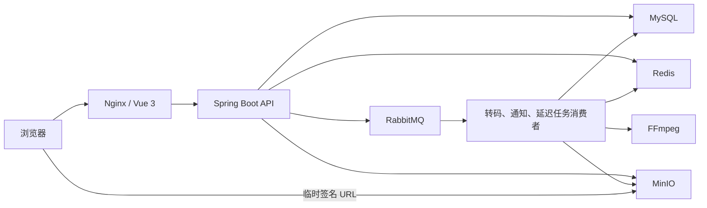

# VideoNest

后端的 HTTP 状态码、JWT 撤销、认证限流、Flyway 与 Transactional Outbox 设计边界见 [后端可靠性设计](docs/backend-reliability-design.md)。

VideoNest 是一个面向学习、作品展示与小型社区的视频平台。它以 Vue 3 和 Spring Boot 为核心，覆盖视频从上传、转码、审核到发布、播放、互动和资源清理的完整生命周期。


## 亮点

- 完整视频链路：上传原视频、RabbitMQ 异步转码、审核发布、多清晰度播放与延迟清理。
- 可扩展的读路径：Redis ZSet 热榜、播放量 Redis 原子累计与 MySQL 批量回写、MinIO 直连播放。
- 可靠异步任务：发布确认、消费重试、死信队列、事件幂等、Redis 锁与人工重投。
- 社区能力：注册登录、JWT 鉴权、点赞、收藏、评论与回复、关注、通知和管理后台。
- 一键运行：Docker Compose 编排前端、后端、MySQL、Redis、RabbitMQ、MinIO 与 Nginx。

## 架构



项目采用模块化单体：认证、视频、上传、互动、关注、通知等模块运行在一个 Spring Boot 应用中；转码和通知通过消息队列解耦。这个形态便于本地部署，也为后续拆分独立 Worker 留出空间。

## 功能一览

| 模块 | 能力 |
|---|---|
| 用户与认证 | 注册、登录、JWT 鉴权、普通用户/管理员权限、个人主页 |
| 视频发现 | 首页推荐、热门榜、分类筛选、关键词搜索、分页列表 |
| 投稿与播放 | 封面/视频上传、480P/720P/1080P 转码、自动截帧、清晰度切换、MinIO 直连播放 |
| 审核与创作 | 投稿状态、审核通过/驳回、创作者视频管理、回收站与延迟清理 |
| 社区互动 | 点赞、收藏、一级评论、回复、关注、粉丝列表 |
| 通知与运维 | 互动通知、未读数、死信查看/忽略/重投、评论与视频管理 |

视频状态流转：

```text
上传 → PROCESSING → PENDING → PUBLISHED
                  ├→ PROCESS_FAILED
                  └→ REJECTED
```

## 技术栈

| 层级 | 技术 |
|---|---|
| 前端 | Vue 3、TypeScript、Vite、Vue Router、Axios、Element Plus |
| 后端 | Java 21、Spring Boot 4、Spring Security、JWT、MyBatis-Plus、HikariCP |
| 数据与缓存 | MySQL 8.4、Redis 7.4、Lua、Redis ZSet |
| 异步与存储 | RabbitMQ、MinIO、FFmpeg |
| 部署 | Docker Compose、Nginx、Maven、npm |

## 快速开始

### 前置条件

推荐通过 Docker Compose 启动全部服务：

- Docker Desktop / Docker Engine 与 Docker Compose v2
- 至少 4 GB 可用内存；首次启动需能够下载镜像

本地源码开发还需要 JDK 21、Node.js 20+、Maven 3.9+ 和 FFmpeg。

### 1. 配置环境变量

```powershell
Copy-Item .env.example .env
```

编辑 `.env`，替换所有示例密码和 `JWT_SECRET`。不要提交包含真实密钥的 `.env`。

### 2. 启动服务

```powershell
docker compose up -d --build
docker compose ps
```

如果宿主机的 `3306` 已被本地 MySQL 占用，使用本项目提供的压测/本地兼容覆盖配置。它只移除 MySQL 的宿主机端口映射，容器间连接不受影响：

```powershell
docker compose -f docker-compose.yml -f docker-compose.benchmark.yml up -d --build
```

停止服务：

```powershell
docker compose down
```

### 本地打包、服务器只复制产物

适用于不希望服务器下载 Maven/npm 依赖的部署方式。本地 PowerShell 执行：

```powershell
.\scripts\deploy.ps1
```

该命令会完成后端测试与 Jar 构建、前端生产构建、打包、上传 `.env`、数据库增量迁移以及远程 Compose 重启。远程只重新构建 `backend` 和 `frontend`，RabbitMQ、MySQL、Redis、MinIO 会复用服务器已有镜像。常用参数：

```powershell
.\scripts\deploy.ps1 `
  -Server "82.157.205.6" `
  -RemoteUser "ubuntu" `
  -RemoteDir "/opt/videonest" `
  -IdentityFile "C:\keys\server.pem" `
  -PublicSiteUrl "https://video.example.com"
```

重复使用已生成的压缩包可加 `-SkipBuild`；紧急部署可用 `-SkipTests`；只有明确不需要执行数据库迁移时才使用 `-SkipMigrations`。也可以只生成部署包：

```powershell
.\scripts\package-deploy.ps1 -PublicSiteUrl "https://video.example.com"
```

服务器解压后，使用产物构建覆盖文件启动；后端镜像只复制 Jar，前端镜像只复制 `dist`：

```bash
cd /opt/videonest
tar -xzf /tmp/videonest-deploy.tar.gz -C /opt/videonest
sudo docker compose -f docker-compose.yml -f docker-compose.jar.yml up -d --build
```

该模式复用服务器已有的 `videonest-backend:latest` 运行镜像（其中包含 FFmpeg），因此部署构建不会再下载 Maven、npm 或 Alpine 的 FFmpeg 包。

### 服务地址

| 服务 | 地址 |
|---|---|
| VideoNest | `http://127.0.0.1` |
| 后端 API | `http://127.0.0.1:8080` |
| RabbitMQ 管理台 | `http://127.0.0.1:15672` |
| MinIO API / 管理台 | `http://127.0.0.1:9000` / `http://127.0.0.1:9001` |
| MySQL / Redis | `127.0.0.1:3306` / `127.0.0.1:6379` |

使用 `docker-compose.benchmark.yml` 覆盖配置时，MySQL 仅在 Docker 网络内可访问，不会监听宿主机 `3306`。

首次初始化时，Compose 会执行 `sql` 目录中已挂载的初始化和增量脚本。一键部署还会幂等执行评论层级迁移；生产部署前仍建议备份数据库。

## 本地开发

先启动基础设施：

```powershell
docker compose up -d mysql redis rabbitmq minio minio-init
```

启动后端：

```powershell
cd backend
mvn spring-boot:run
```

启动前端：

```powershell
cd frontend
npm install
npm run dev
```

开发前端默认监听 `http://127.0.0.1:5173`，并将 `/api` 代理到后端。

## 常用命令

```powershell
# 后端测试与打包
cd backend
mvn test
mvn package

# 前端构建
cd ../frontend
npm run build

# 构建全部容器镜像
cd ..
docker compose build
```

## API 模块

| 模块 | 接口前缀 | 示例能力 |
|---|---|---|
| 认证 | `/api/auth` | 注册、登录 |
| 视频与分类 | `/api/videos`、`/api/categories` | 列表、详情、热门榜、分类 |
| 互动与评论 | `/api/videos/{videoId}`、`/api/videos/{videoId}/comments` | 点赞、收藏、评论、回复 |
| 上传与创作 | `/api/files`、`/api/creator` | 文件上传、投稿、创作者视频 |
| 用户关系与通知 | `/api/users`、`/api/notifications` | 关注、粉丝、通知、未读数 |
| 管理后台 | `/api/admin/videos`、`/api/admin/comments`、`/api/admin/dead-letters` | 审核、回收站、评论与死信管理 |

所有接口统一返回 `ApiResponse`。需登录的接口通过 `Authorization: Bearer <token>` 传递 JWT。

## 配置说明

完整模板见 [.env.example](.env.example)。常用变量如下：

| 分类 | 变量 |
|---|---|
| MySQL | `DB_NAME`、`DB_USERNAME`、`DB_PASSWORD`、`MYSQL_ROOT_PASSWORD` |
| Redis | `REDIS_USERNAME`、`REDIS_PASSWORD` |
| RabbitMQ | `RABBITMQ_USERNAME`、`RABBITMQ_PASSWORD` |
| MinIO | `MINIO_ACCESS_KEY`、`MINIO_SECRET_KEY`、`MINIO_BUCKET`、`MINIO_PUBLIC_ENDPOINT` |
| 安全 | `JWT_SECRET`、`ANTIVIRUS_COMMAND`、`ANTIVIRUS_REQUIRED` |
| 视频处理 | `VIDEO_PROCESS_CONSUMER_CONCURRENCY`、`FFPROBE_PATH` |
| 业务规则 | `VIDEO_REVIEW_TIMEOUT_MILLISECONDS`、`RESOURCE_RETENTION_DAYS`、`ANONYMOUS_VIEW_LIMIT_PER_MINUTE` |

生产环境应配置强密码、HTTPS、对象存储与 RabbitMQ/MySQL 的网络访问限制、上传病毒扫描、限流、日志脱敏及备份策略。

## 性能验证

项目附带可复现的只读并发压测脚本：

```powershell
# 完整套件：约 7 分钟
node scripts/run-performance-suite.js

# 快速回归：约 100 秒
node scripts/run-performance-suite.js --quick
```

完整套件覆盖首页、热门视频、视频列表、分类、评论和 100/200/400 并发混合流量。它先进行健康预检，再生成 Markdown 报告和原始 JSON；不会调用写接口。

2026-08-02 的本机 Docker、小数据量、热缓存基线：

| 场景 | 结果 |
|---|---|
| 全量只读测试 | 17 个场景、1,169,759 次请求、100% HTTP 200 |
| 混合流量（200 并发，60 秒） | 3,057.65 QPS，P99 144.94 ms |
| 热门视频（100 并发） | 1,990.58 QPS，P99 62.04 ms |
| 视频列表（100 并发） | 3,304.78 QPS，P99 64.61 ms |

详情、边界和复现说明见 [压测报告](docs/performance-test-2026-08-02.md)。这些结果仅代表该本机环境，不构成生产容量承诺；生产评估应使用独立发压机、接近生产的数据规模以及 10～30 分钟以上的读写混合流量。

## 项目结构

```text
videonest/
├─ backend/                    # Spring Boot 后端
│  ├─ src/main/java/.../module/ # auth、video、upload、interaction、follow、notification
│  ├─ src/main/resources/       # 配置与 MyBatis Mapper
│  └─ src/test/                 # 自动化测试
├─ frontend/                    # Vue 3 前端与 Nginx 配置
├─ deploy/                      # 独立基础设施部署文件
├─ docs/                        # 截图、压测报告与原始结果
├─ scripts/                     # 可复现压测脚本
├─ sql/                         # 初始化与增量 SQL
├─ docker-compose.yml           # 完整服务编排
├─ docker-compose.benchmark.yml # 本机端口冲突覆盖配置
└─ .env.example                 # 环境变量模板
```

## 当前边界

- 当前为单实例模块化单体，未提供服务级高可用。
- 转码会受单机 CPU、内存和 FFmpeg 并发限制；大量投稿会在队列中排队。
- 标题搜索为 MySQL 模糊匹配；大规模全文检索可接入 Elasticsearch。
- 视频流在生产环境应配合 CDN、独立对象存储与带宽规划。
- 写接口、登录与上传/转码需要在隔离环境中独立进行容量与故障恢复测试。

## 安全提示

- 不要提交 `.env`、真实密码、JWT 密钥或 MinIO 密钥。
- 生产环境必须替换所有示例凭据，并限制数据库、消息队列和对象存储的公网访问。
- 上传接口应启用病毒扫描；公网部署应启用 HTTPS、限流、CORS 白名单与审计日志。
